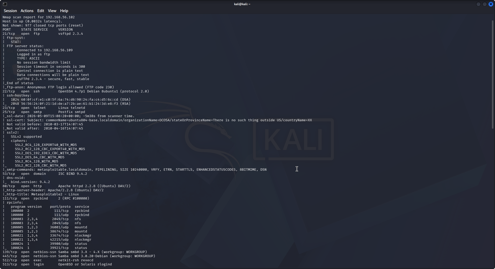
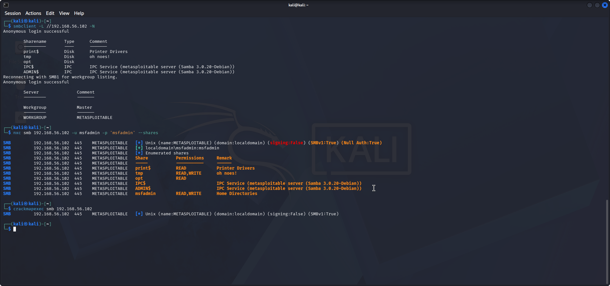
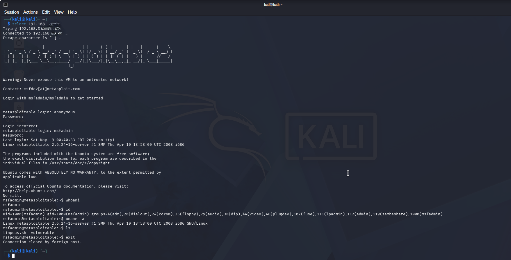
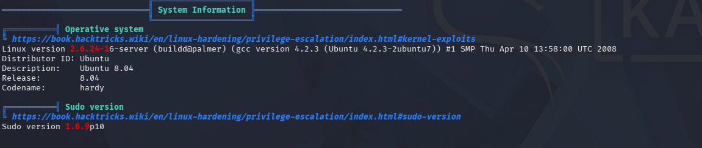
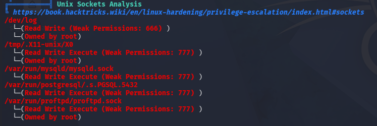
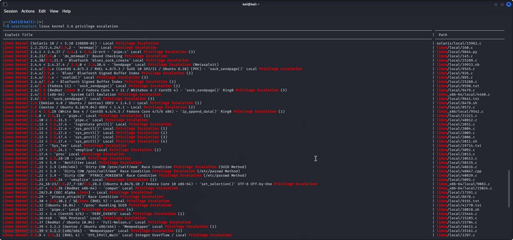
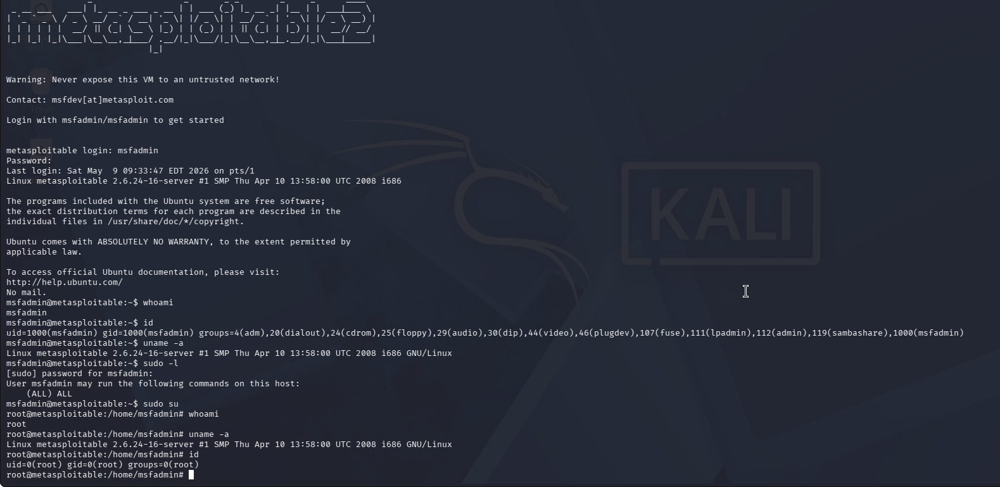

# Internal Network Pentest & Vulnerability Assessment

## Overview

This project demonstrates an internal network penetration test conducted in a controlled lab environment using Metasploitable2/VulnHub machines.

The assessment focused on:
- Network discovery
- Service enumeration
- Vulnerability identification
- SMB enumeration
- Exploitation
- Local privilege escalation
- Remediation planning

---

## Objectives

- Identify exposed services
- Enumerate vulnerable configurations
- Exploit at least one vulnerability
- Perform privilege escalation
- Document findings professionally
- Provide remediation guidance

---

## Lab Environment

| Component | Details |
|---|---|
| Attacker Machine | Kali Linux |
| Target Machine | Metasploitable2 / VulnHub |
| Network Type | Host-Only / NAT |
| Tools Used | Nmap, smbclient, smbmap, LinPEAS, searchsploit |

---

## Skills Demonstrated

- Network reconnaissance
- Service enumeration
- SMB enumeration
- Vulnerability assessment
- Linux privilege escalation
- Exploit research
- Reporting & remediation planning

---

## Tools Used

| Tool | Purpose |
|---|---|
| Nmap | Port scanning & service detection |
| smbclient | SMB share enumeration |
| smbmap | SMB permissions mapping |
| LinPEAS | Linux privilege escalation checks |
| Searchsploit | Exploit research |

---

## Project Workflow

1. Network Discovery
2. Port Scanning
3. Service Enumeration
4. SMB Enumeration
5. Vulnerability Identification
6. Exploitation
7. Local Privilege Escalation
8. Remediation Planning

---

## Screenshots

### Nmap Scan

### SMB Enumeration

## Initial Access

## LinPEAS Analysis

## Privilege Escalation Research

### Privilege Escalation

---

## Disclaimer

This project was conducted in a legal and isolated lab environment for educational purposes only.
